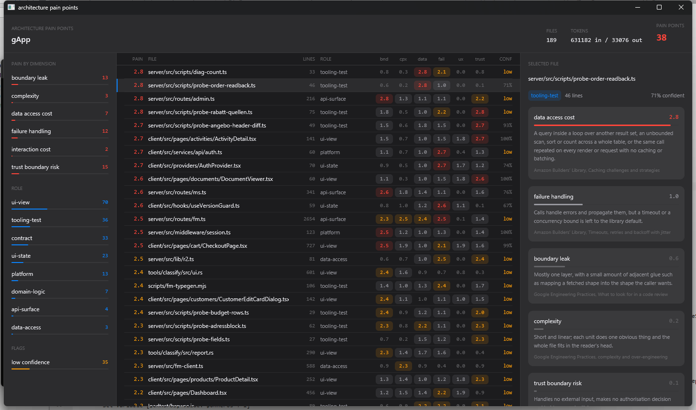

# painpoints

**Find the architectural pain points in any codebase.** A CLI, an MCP server
and a native viewer that score every source file on layering, complexity, data
access cost, failure handling, UI cost and trust-boundary risk, then hand AI
coding agents a ranked, self-explaining report of the technical debt worth
fixing first.

[](LICENSE)
[](https://github.com/prodBirdy/painpoints/releases)
[](Cargo.toml)

Point it at a repository. It scores every source file on six architectural pain
dimensions and writes a ranked report an AI coding agent can read before it
touches anything. Works with Claude Code, Cursor, Codex and anything else that
speaks the Model Context Protocol or can run a command.

The dimensions are not invented. Each one's levels describe situations that
Google, Amazon and OWASP have published warnings about, so a finding can be
checked against its source instead of taken on trust.

```
$ painpoints ~/myapp --headless

classifying 189 files
  189/189
189 files (0 reused), 40 pain points, 631247 in / 33074 out tokens
~/myapp/.painpoints/architecture-pain.json
~/myapp/.painpoints/ARCHITECTURE-PAIN.md
```

```
| file                                  | role        | worst            | score | bnd | cpx | data | fail | ux  | trust |
| ------------------------------------- | ----------- | ---------------- | ----- | --- | --- | ---- | ---- | --- | ----- |
| server/src/routes/admin.ts            | api-surface | boundary_leak    | 2.8   | 2.8 | 1.4 | 1.1  | 1.1  | 0.0 | 2.1   |
| client/src/providers/AuthProvider.tsx | ui-state    | failure_handling | 2.7   | 0.9 | 0.5 | 1.0  | 2.7  | 1.7 | 1.3   |
| server/src/routes/fm.ts               | api-surface | failure_handling | 2.6   | 2.4 | 2.4 | 2.4  | 2.6  | 0.1 | 1.4   |
```

Without `--headless` the same run opens a window for browsing and filtering the
result. Click a file and the right panel shows, for each dimension, the exact
level its score landed on and the standard behind it.



## Install

```
cargo install --git https://github.com/prodBirdy/painpoints
```

or clone and `cargo build --release`. The judgments come from
[TypeSafe](https://typesafe.ai)'s Jev model, a System One model that returns
typed answers and calibrated probabilities rather than prose. See
[Jev: key, gateway, model and cost](#jev-key-gateway-model-and-cost) for setup.

```
painpoints [TARGET] [options]
painpoints mcp

  TARGET            a repository to classify, or a single source file
                    (default: PAINPOINTS_ROOT or the current directory)
  --include DIR     only walk this subdirectory, repeatable
  --limit N         stop after N files
  --out DIR         where the report is written (default: ROOT/.painpoints)
  --headless        write the report without opening a window
  --json            print the result to stdout as JSON
  --refresh         reclassify everything instead of reusing the saved report

  compile [TARGET]  discover AGENTS.md and friends, write .painpoints/rules.json
  mcp               serve the Model Context Protocol on stdio
```

It walks any language it recognises (TypeScript, JavaScript, Python, Go, Rust,
Java, Kotlin, C#, PHP, Ruby, Swift, Scala, Elixir, Dart, Vue, Svelte, Astro,
SQL), respects `.gitignore`, and skips vendored, generated and minified files.

## What it scores

Each file gets one `role` and six scores from 0 (healthy) to 3 (painful). 2.0
and above counts as a pain point. Files rank by their worst dimension first,
then by how many dimensions hurt.

| dimension | the question it answers | standard behind the levels |
| --- | --- | --- |
| `boundary_leak` | Does this file mix responsibilities from different layers, or restate a rule that lives elsewhere? | [Google, What to look for in a code review](https://google.github.io/eng-practices/review/reviewer/looking-for.html) |
| `complexity` | How hard is it for a new reader to change this correctly? Over-engineering counts. | [Google, complexity and over-engineering](https://google.github.io/eng-practices/review/reviewer/looking-for.html) |
| `data_access_cost` | How many round trips, and how much can each return? Query-in-a-loop, unbounded scans, refetch per render. | [Amazon Builders' Library, Caching challenges and strategies](https://aws.amazon.com/builders-library/caching-challenges-and-strategies/) |
| `failure_handling` | Will a slow or failing dependency become a worse failure here? Missing timeouts, retries without backoff, swallowed errors, untested fallbacks. | [Timeouts, retries and backoff with jitter](https://aws.amazon.com/builders-library/timeouts-retries-and-backoff-with-jitter/), [Avoiding fallback in distributed systems](https://aws.amazon.com/builders-library/avoiding-fallback-in-distributed-systems/), [Google SRE, Addressing cascading failures](https://sre.google/sre-book/addressing-cascading-failures/) |
| `interaction_cost` | Does this delay what the user sees or how fast the UI answers input? Main-thread blocking, fetch waterfalls, layout shift. | [web.dev, Core Web Vitals](https://web.dev/articles/vitals), [Optimize long tasks](https://web.dev/articles/optimize-long-tasks), [React, You Might Not Need an Effect](https://react.dev/learn/you-might-not-need-an-effect) |
| `trust_boundary_risk` | What does this file do with untrusted input, authorisation and secrets? | [OWASP Top 10:2021 A01 Broken Access Control](https://owasp.org/Top10/2021/A01_2021-Broken_Access_Control/), [A03 Injection](https://owasp.org/Top10/2021/A03_2021-Injection/) |

The criteria sent to the model describe those situations in plain terms, with
no framework or vendor names, so the scores mean the same thing in a Django
service as in a Next.js app.

## Jev: key, gateway, model and cost

painpoints reads the same variables as TypeSafe's own SDKs, so a setup that
works for their Python or JavaScript client works here unchanged.

| variable | default | purpose |
| --- | --- | --- |
| `TYPESAFE_API_KEY` | none | Bearer token sent as `Authorization: Bearer <key>` |
| `TYPESAFE_BASE_URL` | `https://api.typesafe.ai` | Where requests go; `/v1/systemone` is appended |
| `TYPESAFE_DEFAULT_MODEL` | `jev-latest` | Which Jev release answers |

**Direct.** Create a key in your [TypeSafe](https://typesafe.ai) account and
export it:

```
export TYPESAFE_API_KEY=<your key>
painpoints . --headless
```

**Through a gateway.** If your organisation fronts TypeSafe with an API
gateway (for spend limits, audit logging or a shared key), point the base URL
at it and pass the gateway's token as the key. painpoints sends a plain
`POST <base>/v1/systemone` with a JSON body and a bearer header, so any proxy
that forwards that shape works:

```
export TYPESAFE_BASE_URL=https://ai-gateway.example.com/typesafe
export TYPESAFE_API_KEY=<gateway token>
```

**Pinning the model.** `jev-latest` moves when TypeSafe ships a new release.
The cache digest includes the model name, so a rerun after the alias moves
reclassifies everything. If you have tuned what counts as a pain point against
one release, pin it:

```
export TYPESAFE_DEFAULT_MODEL=jev-1.13.0
```

**Cost.** Each file is one request of roughly 4 to 5 thousand input tokens
(the first 8000 characters of the file plus the question set); output tokens
are free. At TypeSafe's published rate of $0.042 per million input tokens the
189-file repository in the screenshot cost about three cents to classify once,
and nothing to reopen.

## Saved results

The JSON report is also the cache. Every record carries a `digest` over the
question set, the model name, the exact state sent for that file, and the
applied agent rules when any match, so a rerun only calls the API for
files whose digest changed: edit three files in a 300 file repo and the next
run costs three requests. `--refresh` reclassifies everything, and changing a
question or a matching model rule invalidates the digests that used it. With
nothing to reclassify the run needs no API key at all, so reopening the window
to browse the last result is free.

## Agent rules

The six architecture dimensions are fixed. The target repository's own
instruction files are not. painpoints discovers `AGENTS.md`, `AGENT.md`,
`CLAUDE.md`, `AGENTS.txt`, `.cursorrules`, `.cursor/rules/**/*.{md,mdc}`,
`.github/copilot-instructions.md`, `.claude/CLAUDE.md`, nested `AGENTS.md` /
`CLAUDE.md` (scoped to that subtree), and pointer files that say "read X".
It compiles those into a committed, hand-editable `.painpoints/rules.json`:
sources with hashes, and rules bucketed as `lint`, `model`, `deferred` or
`unenforceable`. There are no built-in extra rules.

```
painpoints compile .
```

Classify loads that file (or compiles it if it is missing or stale against
source hashes). Active `model` rules whose `scope` matches the file become
extra Jev questions on the same SystemOne call as the six dimensions.
Violations land in `findings` next to architecture pain, as `rule:<id>`,
quoting the instruction and pointing at `AGENTS.md:12`. Lint rules are
recorded only. `when: turn` rules are kept in `rules.json` but not judged on a
whole-file classify.

The compile is deterministic: it extracts instruction sentences and scaffolds
a choice question (true/false criteria, `violating: ["true"]`) per model rule.
`--draft` prints how to hand-edit those questions so a violating file scores
near 1 and a clean file near 0. Do not add rules the instruction files do not
state.

## For agents

Three ways in, all sharing one cache. The repository also ships a Claude Code
skill at `.claude/skills/painpoints/SKILL.md` that tells an agent when to reach
for the tool, which entry point to pick, and how to read a result without
over-claiming.

**One file, atomic.** Point it at a single file and get that file's result on
stdout. Nothing else is read, nothing else is written.

```
$ painpoints src/routes/admin.ts --json
{
  "path": "src/routes/admin.ts",
  "role": "api-surface",
  "scores": { "boundary_leak": 2.8, "complexity": 1.4, "data_access_cost": 1.1,
              "failure_handling": 1.1, "interaction_cost": 0.0, "trust_boundary_risk": 2.1 },
  "worst_dimension": "boundary_leak",
  "worst_score": 2.8,
  "is_pain_point": true,
  "findings": [
    {
      "dimension": "boundary_leak",
      "score": 2.8,
      "level": 3,
      "description": "Transport, business rules, persistence and presentation are interleaved in one file, or it duplicates a rule that is also defined elsewhere so the copies will drift.",
      "source": "Google Engineering Practices, What to look for in a code review",
      "url": "https://google.github.io/eng-practices/review/reviewer/looking-for.html"
    }
  ],
  "cached": false,
  "tokens": { "input_tokens": 4446, "output_tokens": 175 }
}
```

`findings` is the part worth acting on: one entry per architecture dimension
at 2.0 or above, carrying the level the score landed on, its description, and
the published standard behind it, plus one entry per agent-rule violation
(`dimension` is `rule:<id>`, `source` is the instruction file and line). A
healthy file returns an empty `findings` array, which is a real answer rather
than a shrug.

**The whole codebase.** `painpoints . --json` returns the same shape as the
saved report: `summary.by_dimension` for the distribution, `files` ranked worst
first, `dimensions` with a `url` each.

**As a tool call.** `painpoints mcp` serves the Model Context Protocol on
stdio with two tools:

| tool | arguments | returns |
| --- | --- | --- |
| `painpoints_file` | `path`, `refresh?` | the atomic result above |
| `painpoints_repo` | `root?`, `include?`, `limit?`, `top?`, `refresh?` | distribution, the worst `top` files with their findings, and where the report was written |

```json
{
  "mcpServers": {
    "painpoints": {
      "command": "painpoints",
      "args": ["mcp"],
      "env": { "TYPESAFE_API_KEY": "<your key>" }
    }
  }
}
```

Scores are model judgments over the first 8000 characters of a file. They are a
reading order, not evidence. Anything flagged `needs_review` is where the model
itself was unsure, and a file whose interesting code starts past 8000
characters is judged on what came before it.

## Related

painpoints sits between a linter and an architecture review. Linters and
SonarQube-style analysers catch rule violations line by line; this asks the
six questions a senior reviewer asks about a whole file and answers them
against published standards, in a shape an agent can act on. It does not
replace tests, a type checker or a security scanner.

## Licence

MIT
