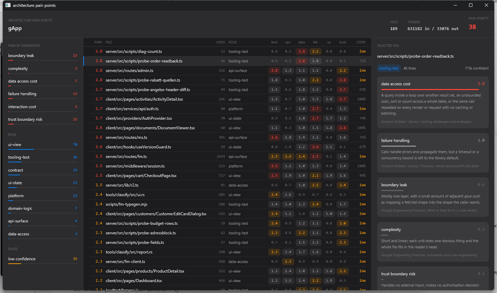

# painpoints

**Find the architectural pain points in any codebase.** A CLI, an MCP server
and a native viewer that score every source file on layering, complexity, data
access cost, failure handling, UI cost and trust-boundary risk, then hand AI
coding agents a ranked, self-explaining report of the technical debt worth
fixing first.

[](LICENSE)
[](https://github.com/prodBirdy/painpoints/releases)
[](Cargo.toml)

Point it at a repository. It scores every source file on six architectural pain
dimensions and writes a ranked report an AI coding agent can read before it
touches anything. Works with Claude Code, Cursor, Codex and anything else that
speaks the Model Context Protocol or can run a command.

The dimensions are not invented. Each one's levels describe situations that
Google, Amazon and OWASP have published warnings about, so a finding can be
checked against its source instead of taken on trust.

```
$ painpoints ~/myapp --headless

classifying 189 files
  189/189
189 files (0 reused), 40 pain points, 631247 in / 33074 out tokens
~/myapp/.painpoints/architecture-pain.json
~/myapp/.painpoints/ARCHITECTURE-PAIN.md
```

```
| file                                  | role        | worst            | score | bnd | cpx | data | fail | ux  | trust |
| ------------------------------------- | ----------- | ---------------- | ----- | --- | --- | ---- | ---- | --- | ----- |
| server/src/routes/admin.ts            | api-surface | boundary_leak    | 2.8   | 2.8 | 1.4 | 1.1  | 1.1  | 0.0 | 2.1   |
| client/src/providers/AuthProvider.tsx | ui-state    | failure_handling | 2.7   | 0.9 | 0.5 | 1.0  | 2.7  | 1.7 | 1.3   |
| server/src/routes/fm.ts               | api-surface | failure_handling | 2.6   | 2.4 | 2.4 | 2.4  | 2.6  | 0.1 | 1.4   |
```

Without `--headless` the same run opens a window for browsing and filtering the
result. Click a file and the right panel shows, for each dimension, the exact
level its score landed on and the standard behind it.



## Install

```
cargo install --git https://github.com/prodBirdy/painpoints
```

or clone and `cargo build --release`. The judgments come from a System One
model, one that returns typed answers and calibrated probabilities rather than
prose: [TypeSafe](https://typesafe.ai)'s Jev or Cloudflare's Clef. See
[Models: Jev or Clef](#models-jev-or-clef) for setup.

```
painpoints [TARGET] [options]
painpoints compile [TARGET]
painpoints eval
painpoints mcp

  TARGET            a repository to classify, or a single source file
                    (default: PAINPOINTS_ROOT or the current directory)
  --include DIR     only walk this subdirectory, repeatable
  --limit N         stop after N files
  --out DIR         where the report is written (default: ROOT/.painpoints)
  --headless        write the report without opening a window
  --json            print the result to stdout as JSON and write nothing else
  --refresh         reclassify everything instead of reusing the saved report
  -h, --help        this text

  compile           discover AGENTS.md and friends, write .painpoints/rules.json
  --draft           after compile, print how to hand-edit model questions
  eval              run the built-in labelled files through the configured
                    model and print how well each bad-decision detector
                    separates the planted problem from clean code
  mcp               serve the Model Context Protocol on stdio, exposing
                    painpoints_file and painpoints_repo

Classifying needs a System One model. compile does not.
  TypeSafe Jev:    TYPESAFE_API_KEY (optional TYPESAFE_BASE_URL)
  Cloudflare Clef: CLOUDFLARE_API_TOKEN and CLOUDFLARE_ACCOUNT_ID
  PAINPOINTS_PROVIDER=typesafe|cloudflare picks one when both are set;
  PAINPOINTS_MODEL overrides the model (default jev-latest or clef-flash).
```

`compile` does not call the model and does not need an API key. Classify loads
`.painpoints/rules.json` (or compiles it if that file is missing or stale).

It walks any language it recognises (TypeScript, JavaScript, Python, Go, Rust,
Java, Kotlin, C#, PHP, Ruby, Swift, Scala, Elixir, Dart, Vue, Svelte, Astro,
SQL), respects `.gitignore`, and skips vendored, generated and minified files.
A git worktree whose `.git` is a file (not a directory) is scanned the same way
as a normal checkout.

## What it scores

Each file gets one `role`, six scores from 0 (healthy) to 3 (painful), and a
verdict on ten concrete [bad decisions](#bad-decisions). A score of 2.0 and
above, a confirmed bad decision or a broken agent rule makes a file a pain
point. Files with confirmed bad decisions or rule violations rank first, then
by their worst dimension, then by how many dimensions hurt.

| dimension | the question it answers | standard behind the levels |
| --- | --- | --- |
| `boundary_leak` | Does this file mix responsibilities from different layers, or restate a rule that lives elsewhere? | [Google, What to look for in a code review](https://google.github.io/eng-practices/review/reviewer/looking-for.html) |
| `complexity` | How hard is it for a new reader to change this correctly? Over-engineering counts. | [Google, complexity and over-engineering](https://google.github.io/eng-practices/review/reviewer/looking-for.html) |
| `data_access_cost` | How many round trips, and how much can each return? Query-in-a-loop, unbounded scans, refetch per render. | [Amazon Builders' Library, Caching challenges and strategies](https://aws.amazon.com/builders-library/caching-challenges-and-strategies/) |
| `failure_handling` | Will a slow or failing dependency become a worse failure here? Missing timeouts, retries without backoff, swallowed errors, untested fallbacks. | [Timeouts, retries and backoff with jitter](https://aws.amazon.com/builders-library/timeouts-retries-and-backoff-with-jitter/), [Avoiding fallback in distributed systems](https://aws.amazon.com/builders-library/avoiding-fallback-in-distributed-systems/), [Google SRE, Addressing cascading failures](https://sre.google/sre-book/addressing-cascading-failures/) |
| `interaction_cost` | Does this delay what the user sees or how fast the UI answers input? Main-thread blocking, fetch waterfalls, layout shift. | [web.dev, Core Web Vitals](https://web.dev/articles/vitals), [Optimize long tasks](https://web.dev/articles/optimize-long-tasks), [React, You Might Not Need an Effect](https://react.dev/learn/you-might-not-need-an-effect) |
| `trust_boundary_risk` | What does this file do with untrusted input, authorisation and secrets? | [OWASP Top 10:2021 A01 Broken Access Control](https://owasp.org/Top10/2021/A01_2021-Broken_Access_Control/), [A03 Injection](https://owasp.org/Top10/2021/A03_2021-Injection/) |

The criteria sent to the model describe those situations in plain terms, with
no framework or vendor names, so the scores mean the same thing in a Django
service as in a Next.js app.

Long files are read whole, in overlapping windows of up to 8000 characters (at
most six per file); a file is as painful as its worst window.

## Bad decisions

The dimension scores answer "how much of this quality does the file have",
and a model asked that about a whole file drifts to the middle of the scale.
So each file is also asked ten narrow questions of the form "is there at least
one ...", each with a worked example of the mistake and of the fix. These are
what name something specific to fix:

| detector | dimension | catches |
| --- | --- | --- |
| `query_in_loop` | data access cost | a query or remote call per item of another result set |
| `unbounded_read` | data access cost | a whole table or collection read with no limit or filter |
| `swallowed_error` | failure handling | a catch that returns null, empty or a default so failure looks like "not found" |
| `unsafe_retry` | failure handling | retries with no backoff or timeout, or a retried charge/create/send with no idempotency key |
| `injection` | trust boundary risk | external input interpolated into SQL, a shell command, a path, HTML or a redirect |
| `missing_ownership_check` | trust boundary risk | a handler that reads, changes or deletes a record by a request id without checking who owns it |
| `hardcoded_secret` | trust boundary risk | a password, key or token written into the source |
| `raw_error_to_user` | trust boundary risk | `error.message`, `String(error)` or a stack sent to a client |
| `speculative_abstraction` | complexity | an interface, factory or option with one implementation or value |
| `layer_mixing` | boundary leak | a UI component that queries a database or holds pricing, permission or eligibility rules |

A detector at 0.75 or above is `act` and becomes a finding (`bad:<id>`, with
the line range of the window it was found in when the file needed more than
one); 0.5 to 0.75 is `flag` and marks the file for review.

**Measured, not assumed.** `painpoints eval` runs fourteen labelled files
built into the binary (ten with one planted bad decision each, four clean
counterparts) through whatever model is configured and prints, per detector,
the probability on the planted file and the worst probability on any other
file. On Cloudflare with the default cascade:

```
detectors at 0.75: caught 10/10 planted, 0 false alarms in 130 checks
dimension scores at 2.0: caught 4/10 planted
```

The planted files were written alongside the questions, so that is an upper
bound. On 40 backend files of a real Hono/Kysely service the same setup
confirmed 12 bad decisions (raw errors returned to clients, swallowed database
errors, per-item remote calls in a loop), every one of which was real on
reading the code, and missed two that a reader would flag.
## Models: Jev or Clef

Every System One model takes the same request (`model`, `state`, `questions`)
and answers the same way, so painpoints only needs to know where to send it.

| variable | default | purpose |
| --- | --- | --- |
| `PAINPOINTS_PROVIDER` | whichever key is set, TypeSafe first | `typesafe` or `cloudflare` |
| `PAINPOINTS_MODEL` | `jev-latest` or `clef-flash` | the model that answers every question |
| `PAINPOINTS_CONFIRM_MODEL` | `clef` behind `clef-flash`, otherwise none | a larger model that re-answers unsure detector questions; `none` turns it off |
| `TYPESAFE_API_KEY` | none | TypeSafe bearer token |
| `TYPESAFE_BASE_URL` | `https://api.typesafe.ai` | TypeSafe or a gateway in front of it; `/v1/systemone` is appended |
| `TYPESAFE_DEFAULT_MODEL` | `jev-latest` | Jev release, when `PAINPOINTS_MODEL` is not set |
| `CLOUDFLARE_API_TOKEN` | none | Cloudflare API token with the Workers AI permission |
| `CLOUDFLARE_ACCOUNT_ID` | none | the account the token belongs to (`cf auth whoami` shows it) |
| `CLOUDFLARE_BASE_URL` | `https://api.cloudflare.com/client/v4` | Cloudflare API or an AI Gateway in front of it |

**TypeSafe Jev.** Create a key in your [TypeSafe](https://typesafe.ai)
account. painpoints reads the same variables as TypeSafe's own SDKs:

```
export TYPESAFE_API_KEY=<your key>
painpoints . --headless
```

To go through an API gateway (spend limits, audit logging, a shared key),
point `TYPESAFE_BASE_URL` at it and pass the gateway's token as the key;
painpoints sends a plain `POST <base>/v1/systemone` with a bearer header.

**Cloudflare Clef.** [Clef and Clef-flash](https://developers.cloudflare.com/workers-ai/models/clef/)
run on Workers AI. Create an API token with the Workers AI permission:

```
export CLOUDFLARE_API_TOKEN=<token>
export CLOUDFLARE_ACCOUNT_ID=<account id>
painpoints . --headless
```

By default every question goes to Clef-flash, and any bad-decision question
it answers at 0.3 or above is asked again of Clef on the same window, alone.
On real code Clef-flash scores genuine problems between 0.3 and 0.7 where Clef
scores them above 0.9, while a few percent of questions reach the cut-off, so
the cascade gets close to Clef's accuracy for a small part of Clef's price.
Decisions answered this way carry `confirmed_by`. Set
`PAINPOINTS_MODEL=clef` to use Clef for everything, or
`PAINPOINTS_CONFIRM_MODEL=none` for Clef-flash alone.

**Pinning the model.** Aliases such as `jev-latest` move. The cache digest
includes the model names, so a rerun after one moves, or after switching
provider, reclassifies everything. Pin a release if you have tuned against it:

```
export PAINPOINTS_MODEL=jev-1.13.0
```

**Cost.** Each window is one request: the window's source plus the question
set, about 4 to 5 thousand input tokens for a file with no matching agent
rules, more with them (each compiled rule adds a question). Output tokens are
free. Jev costs $0.042 per million input tokens. Clef-flash costs $0.09 and
Clef $0.24, which on Workers AI's free allocation of 10,000 neurons a day is
about 1.2 million Clef-flash tokens; 40 files of a real service with 20 agent
rules took about 560 thousand tokens including the Clef confirmations.

## Saved results

The JSON report is also the cache. Every record carries a `digest` over the
question set, the model name, the exact state sent for that file, and the
applied agent rules when any match, so a rerun only calls the API for
files whose digest changed: edit three files in a 300 file repo and the next
run costs three requests. `--refresh` reclassifies everything, and changing a
question or a matching model rule invalidates the digests that used it. With
nothing to reclassify the run needs no API key at all, so reopening the window
to browse the last result is free.

## Agent rules

The six architecture dimensions are fixed. The target repository's own
instruction files are not. `painpoints compile [TARGET]` discovers those files
and writes a committed, hand-editable `.painpoints/rules.json`: sources with
hashes, and rules bucketed as `lint`, `model`, `deferred` or `unenforceable`.
There are no built-in extra rules.

Sources, in the order they are found:

- `AGENTS.md`, `AGENT.md`, `CLAUDE.md`, `AGENTS.txt`
- `.cursorrules`, `.cursor/rules/**/*.{md,mdc}`
- `.github/copilot-instructions.md`, `.claude/CLAUDE.md`
- nested `AGENTS.md` / `CLAUDE.md` (scoped to that subtree)
- pointer files that say "read X"

Gitignored trees and `.claude/worktrees` / `.cursor/worktrees` are skipped.

```
painpoints compile .
```

Classify loads that file (or compiles it if it is missing or stale against
source hashes). Active `model` rules whose `scope` matches the file become
extra questions on the same System One call as the six dimensions. They sit
beside those dimensions, not in place of them: violations land in `findings`
as `rule:<id>`, quoting the instruction and pointing at `AGENTS.md:12`.
Architecture scores stay the same. Lint rules are recorded only.
`when: turn` rules stay in `rules.json` but are not judged on a whole-file
classify.

Process and conversation rules (branch names, PR wording, worktrees, which
model to use) compile as `unenforceable` and do not count against the
model-rule caps. Path-scoped rules are preferred when picking the per-file
question budget. Compile prints which sources were truncated instead of
dropping them silently.

A rule that comes back broken on half or more of the files it was asked about
(at least ten) is banded `noisy` instead of `act`: that almost always means the
question does not fit those files, such as a table row or a rule about another
app in the same repository, not that the repository breaks its own rule
everywhere. Noisy rules are listed in the report's `noisy_rules` and do not
rank files or appear in findings until the question is rewritten or scoped.

The compile is deterministic: it extracts instruction sentences and scaffolds
a `choice` question per model rule (true/false criteria,
`violating: ["true"]`), sent as `rule.<id>` because Clef only accepts question
names made of letters, digits, `_`, `.` and `-`. `--draft` prints how to
hand-edit those questions so a violating file scores near 1 and a clean file
near 0. Do not add rules the instruction files do not state.

## For agents

Three ways in, all sharing one cache, plus `painpoints compile [TARGET]` to
refresh `.painpoints/rules.json` without calling the model. The repository
also ships a Claude Code skill at `.claude/skills/painpoints/SKILL.md` that
tells an agent when to reach for the tool, which entry point to pick, and how
to read a result without over-claiming.

**One file, atomic.** Point it at a single file and get that file's result on
stdout. Nothing else is read, nothing else is written.

```
$ painpoints src/routes/admin.ts --json
{
  "path": "src/routes/admin.ts",
  "role": "api-surface",
  "scores": { "boundary_leak": 2.8, "complexity": 1.4, "data_access_cost": 1.1,
              "failure_handling": 1.1, "interaction_cost": 0.0, "trust_boundary_risk": 2.1 },
  "worst_dimension": "boundary_leak",
  "worst_score": 2.8,
  "is_pain_point": true,
  "findings": [
    {
      "dimension": "boundary_leak",
      "score": 2.8,
      "level": 3,
      "description": "Transport, business rules, persistence and presentation are interleaved in one file, or it duplicates a rule that is also defined elsewhere so the copies will drift.",
      "source": "Google Engineering Practices, What to look for in a code review",
      "url": "https://google.github.io/eng-practices/review/reviewer/looking-for.html"
    }
  ],
  "cached": false,
  "tokens": { "input_tokens": 4446, "output_tokens": 175 }
}
```

`findings` is the part worth acting on: one entry per architecture dimension
at 2.0 or above, carrying the level the score landed on, its description, and
the published standard behind it, one entry per confirmed bad decision
(`dimension` is `bad:<id>`, with `lines` when the file was read in more than
one window and `confirmed_by` when a confirming model answered), and one per
agent-rule violation (`dimension` is `rule:<id>`, `source` is the instruction
file and line). A
healthy file returns an empty `findings` array, which is a real answer rather
than a shrug.

**The whole codebase.** `painpoints . --json` returns the same shape as the
saved report: `summary.by_dimension` for the distribution, `files` ranked worst
first, `dimensions` with a `url` each.

**As a tool call.** `painpoints mcp` serves the Model Context Protocol on
stdio with two tools:

| tool | arguments | returns |
| --- | --- | --- |
| `painpoints_file` | `path`, `refresh?` | the atomic result above |
| `painpoints_repo` | `root?`, `include?`, `limit?`, `top?`, `refresh?` | distribution, the worst `top` files with their findings, and where the report was written |

```json
{
  "mcpServers": {
    "painpoints": {
      "command": "painpoints",
      "args": ["mcp"],
      "env": { "TYPESAFE_API_KEY": "<your key>" }
    }
  }
}
```

For Clef, put `CLOUDFLARE_API_TOKEN` and `CLOUDFLARE_ACCOUNT_ID` in `env`
instead.

Scores and decisions are model judgments over the file, read in windows of up
to 8000 characters (at most six per file, so a very long file is judged on its
first 40 thousand or so). They are a reading order, not evidence. Anything
flagged `needs_review` is where the model itself was unsure.

## Related

painpoints sits between a linter and an architecture review. Linters and
SonarQube-style analysers catch rule violations line by line; this asks the
six questions a senior reviewer asks about a whole file and answers them
against published standards, in a shape an agent can act on. It does not
replace tests, a type checker or a security scanner.

## Licence

MIT
